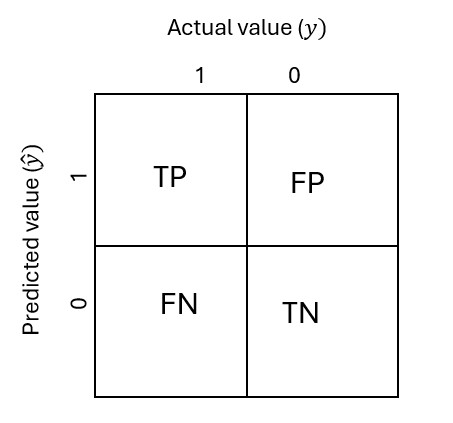
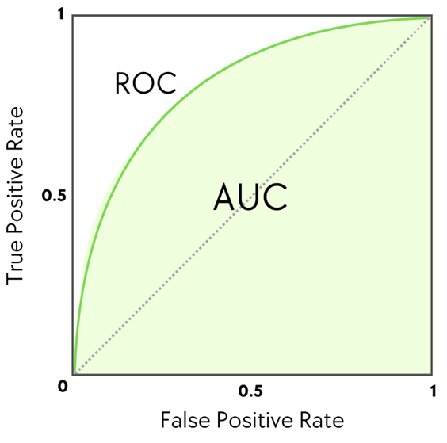
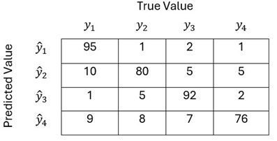

# Lab 4: ML Model Testing and Evaluation

Machine Learning (ML) models play a crucial role in modern software. Testing modern software should include testing the ML models. The design of the ML model is outside the lab's scope. Only ML 
testing will be covered. Different problems will be considered. For each problem type, corresponding metrics are utilized.

## Repository:   
[https://github.com/zubxxr/SOFE3980U-Lab4](https://github.com/zubxxr/SOFE3980U-Lab4) 

## 1. Single-variable Continuous Regression Problem

The goal is to estimate the value of a continuous variable, $$𝑦$$, using the values of input variables, $`\mathbf{x}=\{x_{0},...,x_{n}\}`$. This is achieved by learning the parameters, $\Theta$ of a function $\hat{y}=f_{\Theta}(x)=f_{\Theta}(x_{0},...,x_{n})$ such that estimated value $\hat{y}=f_{\Theta}(x)$ should be much closer to the actual value, $y$. The actual value is sometimes called ground truth. A dataset, $`\mathcal{D}`$, consists of pairs of inputs and output, $`(x^{(i)},y^{(i)}) \forall i \in \{ 0,...,n \}`$, are needed to train the model where $𝑛$ is the length of the dataset. The data set is divided into three non-overlapped sub-sets: training, validation, and testing. The training set is used to tune the model. The validation set is used to evaluate the training process and the training process early if needed. Finally, the test process is used for blind evaluation of different models and hyperparameters. Many metrics can be used as

$MSE=\frac{1}{n} \sum_{i=0}^{n}{\big(y^{(i)}-\hat{y}^{(i)}\big)^2}$      (Mean Square Error)

$`MAE=\frac{1}{n} \sum_{i=0}^{n}{\big|y^{(i)}-\hat{y}^{(i)}\big|}`$      (Mean Absolute Error)

$`MARE=\frac{1}{n} \sum_{i=0}^{n}{\frac{|y^{(i)}-\hat{y}^{(i)}|}{|y^{(i)}|+\epsilon}} *100\%`$      (Mean Absolute Relative Error)

where $\epsilon$ is a very small positive number to avoid dividing by zero. A model becomes better with the decrease of the MSE, MAE, or MARE values.

The folder [/SVCR](/SVCR) within the GitHub repository contains a Maven-managed Java program. The [program](/SVCR/src/main/java/com/ontariotechu/sofe3980U/App.java) reads a CSV file called [model_1.csv](/SVCR/model_1.csv), and displays the first ten lines of the CSV data using a library called [com.opencsv](https://www.geeksforgeeks.org/reading-csv-file-java-using-opencsv/). The POM file has been updated to include the library as a dependency and has been configured to be included in the JAR file. Type the following command to build the program after downloading it from the GitHub repository.
``` cmd
mvn clean package assembly:single
```
and the following line to execute the program
```cmd
java -jar target/SVCR-1.0.0-jar-with-dependencies.jar
```
The [model_1.csv](/SVCR/model_1.csv) file consists of two columns, true and predicted. Those are the validation results of an ML model. The [/SVCR](/SVCR) folder also contains the validation results of two other models in [model_2.csv](/SVCR/model_2.csv) and  [model_3.csv](/SVCR/model_3.csv).

### Task 1:
* Update the Java program to calculate the MSE, MAE, and MARE for all the data stored in the [model_1.csv](/SVCR/model_1.csv) file.
* Repeat the metrics evaluation for the validation results from the [model_2.csv](/SVCR/model_2.csv) and [model_3.csv](/SVCR/model_3.csv) files.
* Figure out the model with the lower error and recommend it.
  
## 2. Single-variable Binary Regression Problem
It's similar to the single-variable continuous regression problem except that the output variable has two values: either zero or one,  $`y \in \{0,1\}`$. The estimated variable has a continuous value between 0 and 1, $`\hat{y}=p(y|x)=f_{\Theta}(\mathbf{x}) \in [0,1]`$. By applying a threshold, the value can be converted into a binary value.

$`\hat{y}_{\text{binary}}=\begin{cases}
      1 & \text{if $\hat{y} >=$ threshold}\\
      0 & \text{if $\hat{y} <$ threshold}\\
    \end{cases}`$
    
The default value of the threshold is 0.5. a binary cross-entropy (BCE) is a metrics to evaluate the model.

$`BCE=-\frac{1}{n} \sum_{i=0}^{n}{y^{(i)} log(\hat{y}^{(i)})+(1-y^{(i)}) log(1-\hat{y}^{(i)})}=-\frac{1}{n} \sum_{i=0}^{n}{\begin{cases}
      log(\hat{y}^{(i)}) & \text{if $y^{(i)}=1$}\\
      log(1-\hat{y}^{(i)}) & \text{if $y^{(i)}=0$}\\
    \end{cases}}`$

Another metrics is confusion matrix which is summarized by the following figure in which TP, FP, TN, and FN stand for True positive, False Positive, True Negative, and False Negative, repectively.

  

$`Accuracy=\frac{TP+TN}{TP+TN+FN+FP}`$

$`Precision=\frac{TP}{TP+FP}`$

$`Recall=\frac{TP}{TP+FN}`$

$`F1_{\text{score}}=2 \frac{Precision*Recall}{Precision+Recall}`$

A better model has a smaller BCE and larger Accuracy, Precision, Recall, and $F1_{\text{score}}$. Another way to evaluate a model is by using a ROC curve. The curve plots the true positive rate versus the false positive rate for different thresholds, as shown in the following figure.

  

The following procedure calculates the $x$ and $y$ coordinates for the ROC curve.

$`n_{positive}=\sum_{i=0}^{n}{(y^{(i)}==1)}`$

$`n_{negative}=\sum_{i=0}^{n}{(y^{(i)}==0)}`$

for i=0:100

$\qquad th$ =i/100.0
  
$`\qquad TP=\sum_{i=0}^{n}{(y^{(i)}==1 \&\&  \hat{y}^{(i)}>=th)}`$
  
$`\qquad TPR=\frac{TP}{n_{positive}}`$
  
$\qquad y[i]=TPR$
  
$`\qquad FP=\sum_{i=0}^{n}{(y^{(i)}==0 \&\&  \hat{y}^{(i)}>=th)}`$
  
$`\qquad FPR=\frac{FP}{n_{negative}}`$
  
$\qquad x[i]=FPR$

The Area under the curve, AUC-ROC, is calculated to evaluate the ROC curve using the following procedure.


auc=0

for i=1:100

$\qquad$ auc += (y[i-1]+y[i])*abs(x[i-1]-x[i])/2

0.5 AUC-ROC value means random guessing. Increasing the AUC-ROC values means an improvement in the model performance. A perfect model has an AUC-ROC value of about 1.

The folder [/SVBR](/SVBR) within the GitHub repository contains a Maven-managed Java program. The [program](/SVBR/src/main/java/com/ontariotechu/sofe3980U/App.java) reads a CSV file called [model_1.csv](/SVBR/model_1.csv) and displays the first ten lines of the CSV data. Type the following command to build the program after downloading it from the GitHub repository.
``` cmd
mvn clean package assembly:single
```
and the following line to execute the program
```cmd
java -jar target/SVBR-1.0.0-jar-with-dependencies.jar
```
The [model_1.csv](/SVBR/model_1.csv) file consists of two columns, true and predicted. Those are the validation results of an ML model. The [/SVBR](/SVBR) folder also contains the validation results of two other models in [model_2.csv](/SVBR/model_2.csv) and  [model_3.csv](/SVBR/model_3.csv).

### Task 2:
* Update the Java program to calculate the BCE, confusion matrix, Accuracy, Precision, Recall, $F1_{\text{score}}$, and AUC-ROC for all the data stored in the [model_1.csv](/SVBR/model_1.csv) file.
* Repeat the metrics evaluation for the validation results from the [model_2.csv](/SVBR/model_2.csv) and [model_3.csv](/SVBR/model_3.csv) files.
* Figure out and report the model with better performance.
  
## 3. Multiclass Classification
It's a different ML problem in which the output is one of a set of $m$ classes $`y \in {1,...,m }`$. The ML model produces $m$ outputs that represent $`\hat{y}_j=p(y_j|x) \forall j \in {1,...,m }`$. the prediction is assigned to the class with the highest probability, $`\hat{y}= argmax_{j}{p(y_j|x)} \forall j \in {1,...,m }`$

Cross entropy can be calculated to evaluate this type of model.

$`CE=-\frac{1}{n} \sum_{i=0}^{n}{\begin{cases}
      log(\hat{y}^{(i)}_1) & \text{if $y^{(i)}=1$}\\
      log(\hat{y}^{(i)}_2) & \text{if $y^{(i)}=2$}\\
      ... \\
      log(\hat{y}^{(i)}_m) & \text{if $y^{(i)}=m$}\\
    \end{cases}}`$

A confusion matrix is constructed, as shown in the following figure.

  

The folder [/MCC](/MCC) within the GitHub repository contains a Maven-managed Java program. The [program](/MCC/src/main/java/com/ontariotechu/sofe3980U/App.java) reads a CSV file called [model.csv](/MCC/model.csv) and displays the first ten lines of the CSV data. Type the following command to build the program after downloading it from the GitHub repository.
``` cmd
mvn clean package assembly:single
```
and the following line to execute the program
```cmd
java -jar target/MCC-1.0.0-jar-with-dependencies.jar
```
The [model.csv](/MCC/model.csv) file consists of six columns. The first is actual class $`\in \{1,...,5\}`$. Other columns represents $`\hat{y}_j`$. Those are the validation results of an ML model. 

### Task 3:
* Update the Java program to calculate the CE and confusion matrix for all the data stored in the [model.csv](/MCC/model.csv) file.

## Discussion
Compare accuracy, recall, and precision by describing the interpretation of each of them. Using examples shows applications in which one of them is more important than the others.

## Deliverables
1. A GitHub link of the code of the three tasks
2. Report about the discussion part and the results of the tasks
